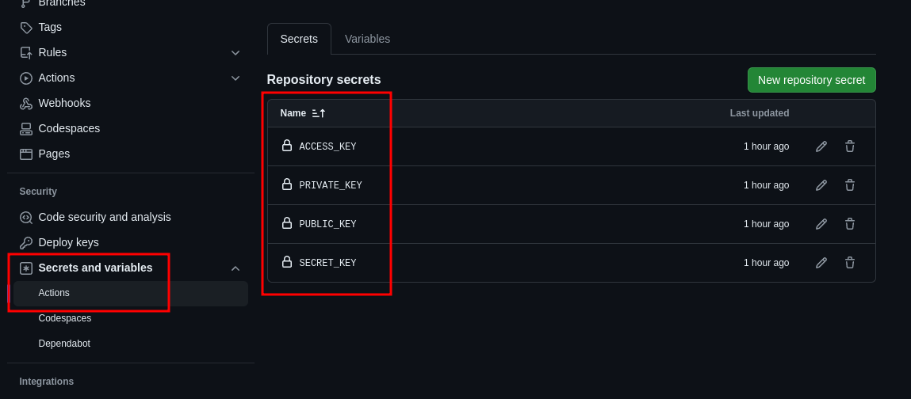
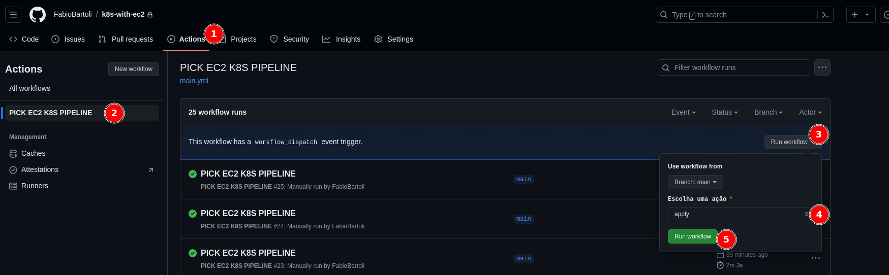
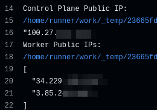
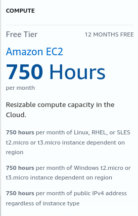

### Motivação e Funcionamento
Baseado nas aulas do [@Badtuxx](https://github.com/Badtuxx) no PICK 2024, resolvi criar esse projeto para realizar a criação de um cluster K8S PARA ESTUDOS de forma automatizada utilizando instâncias EC2 na AWS. 
A ideia aqui é ter total controle do cluster, inclusive do control-plane, para que possamos configurar o que quisermos para entender melhor o funcionamento do Kubernetes. Outra vantagem é o custo, pois dependendo da configuração que você criar este cluster, poderá utilizá-lo com um valor bem baixo, tirando o maior proveito possível do Free Tier da AWS. Leia atentamente a seção ["***Utilizando o Cluster Gratuitamente***"](https://github.com/FabioBartoli/k8s-with-ec2?tab=readme-ov-file#utilizando-o-cluster-gratuitamente)

Este projeto utiliza o **Terraform** para provisionar o ambiente de forma automatizada, facilitando tanto a criação quanto a exclusão ou atualização dos recursos,  e o **Github Actions**, fazendo com que não seja necessário o download do projeto e executá-lo em sua máquina local, caso não queira.
Ao final da execução do deploy, você terá um cluster criado e um sistema de arquivos com **NFS Server** para poder realizar seus laboratórios de Kubernetes
##

> Atenção! Por conformidade, eu estou criando todos os recursos em
> *us-east-1*. Se por algum motivo quiser utilizar outra região, lembre-se de alterar esse valor onde encontrá-lo

##
### Requisitos:
#### Faça um fork deste repositório
Fique à vontade para realizar um fork desse projeto e utilizá-lo. Assim, você não precisará baixar ou instalar qualquer dependência em sua máquina local
##
#### Tenha uma chave SSH
A primeira coisa que você precisará para esse projeto é de uma chave SSH. Você pode ver [este tutorial](https://docs.github.com/pt/authentication/connecting-to-github-with-ssh/generating-a-new-ssh-key-and-adding-it-to-the-ssh-agent) caso não saiba como fazer
Para que o Actions funcione, você precisará salvar suas chaves SSH privada e pública como secrets do repositório github. Os nomes devem ser "**PRIVATE_KEY**" e "**PUBLIC_KEY**", respectivamente
##
#### Crie um usuário no IAM
O próximo passo será criar, em sua AWS Account, um usuário que terá as permissões para criar os recursos necessários na AWS. Em [policy.json](./docs/examples/policy.json), eu deixei disponível a policy que criei na minha conta e que dá todos os acessos que serão necessários
Gere credenciais para este usuário e também as salve como secrets deste repositório no github, com os nome de **ACCESS_KEY** e **SECRET_KEY**
Ao final, você terá as seguintes secrets criadas no repositório:

##
#### Crie um Bucket S3
Ele será necessário para armazenarmos o state da nossa configuração do Terraform de forma segura. Para mais informações, leia [State | Terraform](https://developer.hashicorp.com/terraform/language/state)
##
#### Configure seu ambiente
No arquivo [main.tf](./main.tf), será necessário que você faça algumas alterações para executar em sua conta da AWS, sendo elas:

 - **variable "k8s_subnet_cidr"**: Você deve escolher um CIDR válido em sua VPC e colocar seu valor nesta variável
 - **backend - bucket**: Aqui, substitua o valor atual pelo nome do seu bucket. A key pode deixar como está
 - **Dentro do module "k8s_provisioner"**: Substitua o **vpc_id** pelo ID da sua VPC
Fique à vontade para alterar qualquer outra variável que desejar neste arquivo, mas somente as 3 citadas anteriormente são necessárias para poder executar o pipeline
##
#### Criando ou destruindo o Cluster
Agora que já configuramos o que era necessário, basta utilizarmos o Github Actions para provisionar o nosso cluster. Para isto, é bem simples: Acesse a aba **"Actions"**, selecione a Action **"PICK EC2 K8S PIPELINE"** e então, **"Run Workflow"**
No run, você poderá escolher entre criar o seu cluster (ação "apply"), ou removê-lo completamente (ação "destroy").
Após escolher a ação, basta clicar em **"Run workflow"** e o ambiente começará a ser provisionado.
Quando o pipeline finalizar, você poderá pegar os IPs do seu control-plane e dos workers criados para acessá-los

##
#### Acessando o Cluster
Você precisará da chave privada criada anteriormente para acessar o cluster sempre que quiser. Para isso, basta executar o seguinte comando:

    ssh -i "path/da/chave/id_rsa" ubuntu@ip_publico_da_instancia

##
#### Utilizando o Cluster Gratuitamente
É possível criar e utilizar este cluster de forma gratuita na AWS ou com um valor bem baixo. Para isso, deve-se tomar alguns cuidados, sendo eles:

 1. *Tenha uma conta na AWS que esteja com o **Free Tier** ativo*: É importante que a conta onde você irá criar esse cluster ainda esteja dentro do tempo de 12 meses grátis, principalmente para a criação das instâncias. Para criar esse cluster, você perceberá que eu estou utilizando no [main.tf](./main.tf) instâncias do tipo "t2.micro". Elas estão abaixo do recomendado para rodar o Kubernetes (*requisito mínimo é 2vCPU e 2GiB RAM*), mas para meus laboratórios está suprindo bem (e é free 😁)
 Além disso, você perceberá também que estou definindo valores baixo de disco para cada uma das instâncias: 14GiB para o Control Plane e 8GiB para cada Worker. Fiz isso para que o cluster fique dentro dos 30GiB oferecidos gratuitamente pela AWS, e provisionei mais espaço para o Control-Plane pois é nele que encontra-se o **NFS Server**
 Caso queira utilizar uma instância com o valor mínimo recomendado pelo Kubernetes, altere no [main.tf](./main.tf) o *instance_type* para outro valor. A instância mais barata que atende os requisitos mínimos na região *us-east-1* é a **t3a.small**, que irá gerar um custo de **0.0188 USD por hora** de execução 
 2. *Preste atenção nos valores do Free Tier*: Para utilizar o Free Tier sem surpresas, precisamos prestar atenção principalmente no seguinte: Este cluster está sendo configurado com 3 máquinas EC2 do tipo t2.micro e as 3 possuem um IP público atrelado. Além disso, a soma dos espaços em disco das 3 máquinas correspondem a 30GiB.
 Se olharmos para a [definição de preços da AWS](https://aws.amazon.com/free/?nc1=h_ls&all-free-tier.sort-by=item.additionalFields.SortRank&all-free-tier.sort-order=asc&awsf.Free%20Tier%20Types=tier#12monthsfree&awsf.Free%20Tier%20Categories=*all), veremos os seguinte:
 

Baseado nesse valor de 750 horas para instâncias e 750 horas para IPs públicos, precisamos dividir isso pelo número de instâncias que teremos em nosso cluster. No caso, como estou criando 3 instâncias (1 control plane + 2 workers), eu teria 250 horas grátis por máquina + IP por mês, o que seriam cerca de 10 dias/ mês
Se você aumentar o número de instâncias, os dias do free tier irão diminuir na mesma proporção. Para que você possa utilizar pelo máximo de tempo possível sem gerar custos, lembre-se sempre de realizar o "**destroy**" da sua infraestrutura sempre que não tiver utilizando. Só não esqueça de salvar seus arquivos que estão no cluster :o
3. *Por último: crie um alarme de custos na AWS*: Apesar de todo o cuidado na criação do Cluster, algo não previsto pode acabar gerando custos em sua conta. Para evitar isso, siga [este tutorial da AWS](https://docs.aws.amazon.com/pt_br/AmazonCloudWatch/latest/monitoring/monitor_estimated_charges_with_cloudwatch.html) e crie um alarme para ser avisado sempre que sua conta gerar algum custo. Aqui, eu deixei o alarme para avisar quando o custo estimado chegar em 2 dólares 💸

##
### Considerações finais
Melhorias no projeto são bem-vindas, basta mandar um pull request! 😀
Como este projeto é para um estudo mais simples, não implementei nenhuma lógica para aumentar o número de Control Planes e realizar a configuração de algum tipo de HA quando forem criadas mais máquinas. Então, independente do número que você passar, será criado apenas 1 Control Plane e o restante serão workers. Caso queira implementar algo nesse sentido, fique à vontade!
##### Qualquer dúvida ou sugestão, estou à disposição! >> [Telegram](https://t.me/FabioBartoli) <<
